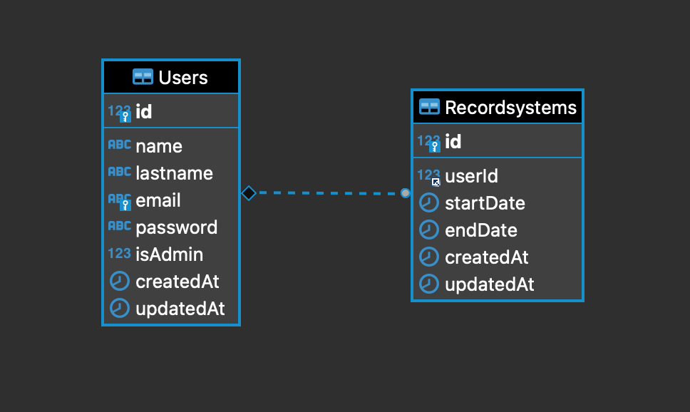
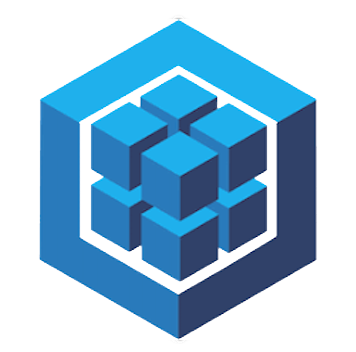

<h1 align="center">
   BOUNSEL RECORD SYSTEM
</h1>

## Instructions 🔧

The first step is to clone the repository and install the project dependencies in your local repository.

### `npm i`

Initializate the Sequelize dependency and fill in the password and database fields in the config.json file.

### `sequelize init`

Migrate the models to the local database.

### `sequelize db:migrate`

Run the server.

### `npm start`

Finally, enter the endpoints petitions in Postman and send them.

## Models relation

The relation between users and orders models is 1 to many (1:n).

## Used technologies

   

Installed dependencies: Express, Axios, MySQL2, Sequelize, Sequelize-cli, Bcrypt and Jsonwebtoken.

## Developer ✍️

[Adriana Fayos](https://github.com/AdrianaFayos)

---